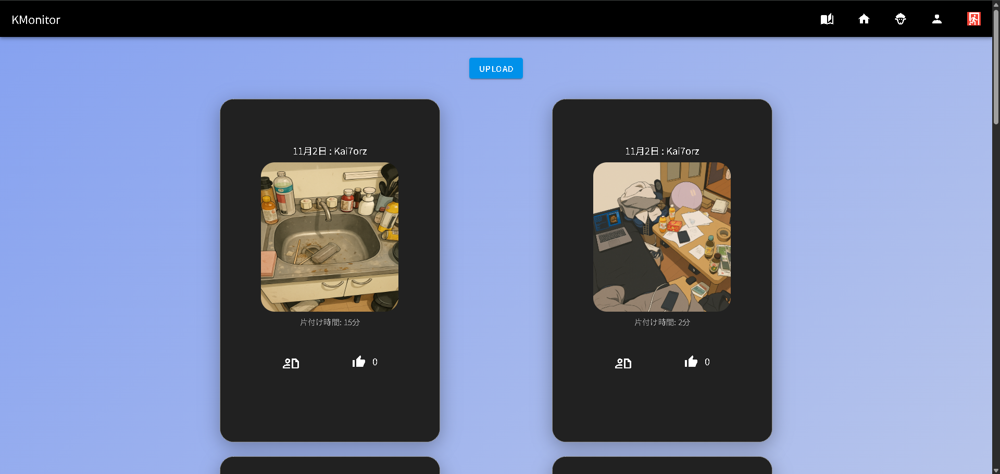
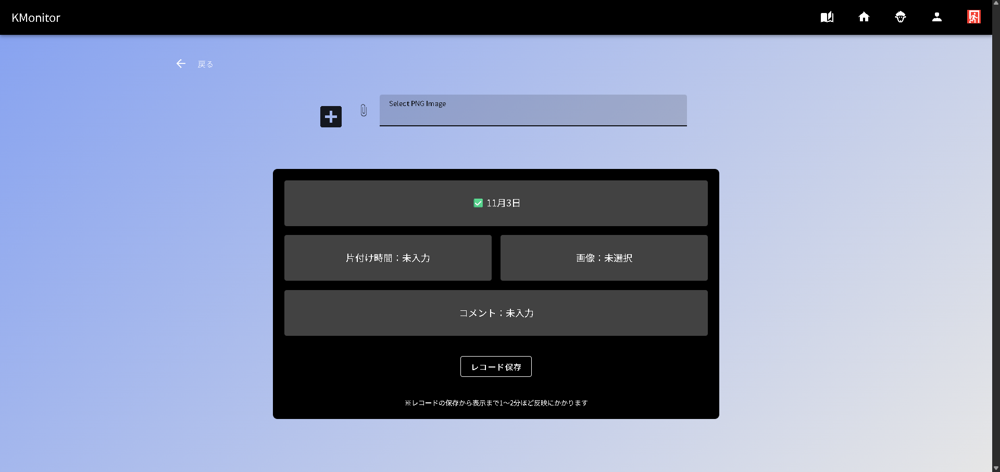
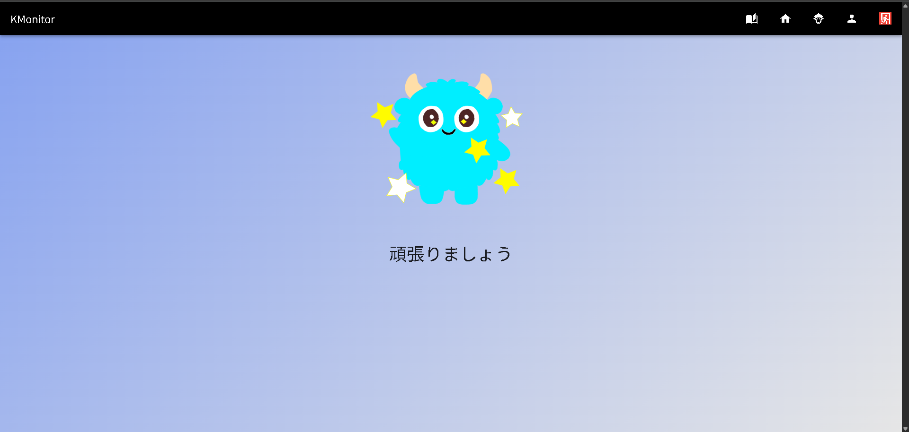
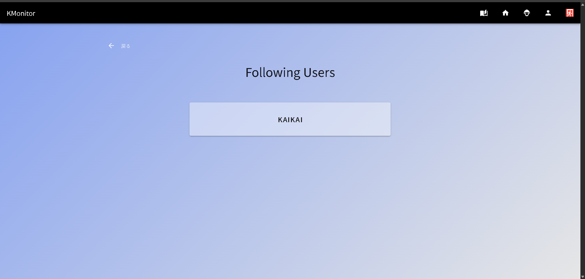
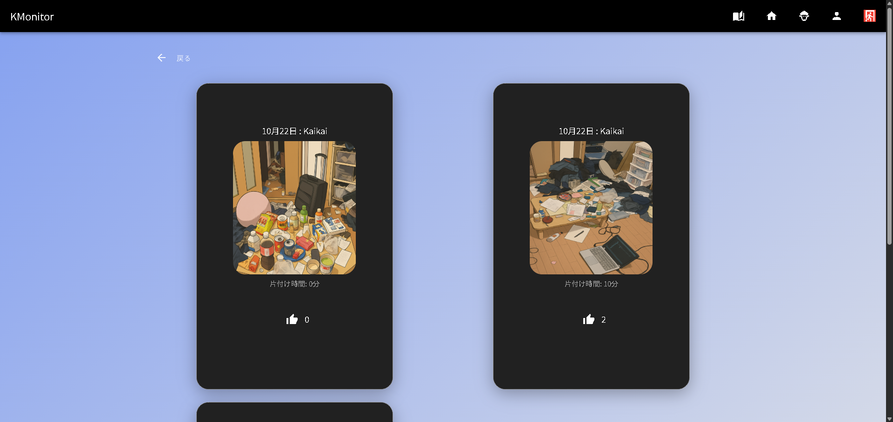
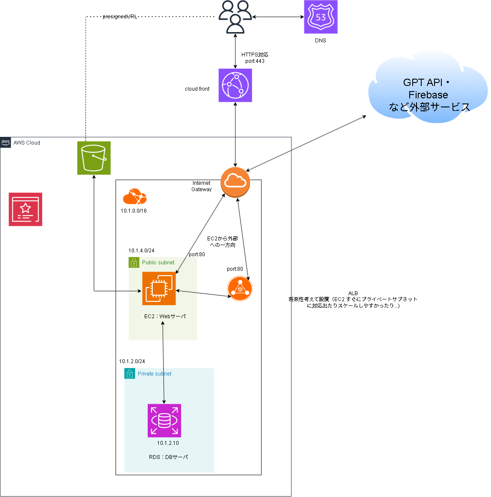

#　KMonitor

## はじめに
- 常に汚い自分の部屋とおさらばするために，片付けを習慣化できるアプリを作成しました!

## コンセプト
- 家に人を呼ぶ前は片付けに気合が入るという自身の経験から，部屋を他人に見てもらうための共有アプリを考えました.（他人に部屋を見られるという監視の目によって自身の片付けの意欲を沸かせる）

## 部屋画像共有の課題・方法

部屋の画像を共有するにあたって以下の問題があります
- 散らばった書類など個人情報が映ってしまう
- 下着など見せたくないものが映ってしまう
- ただの部屋画像だと味気がない

これらの問題を解決し，他の人に見せられるようにするために 部屋画像のイラスト化 を導入しました．
これにより，実際の部屋の汚さは伝わりつつも，共有の心理的なハードルを下げ，他人に見せられるような部屋にするために掃除・きれいな状態の維持をさせる狙いがあります. 

## 主な機能
- ユーザー登録・認証
- 片づけた記録（レコード）のアップロード・取得表示
- 自身のレコード一覧表示
- 他ユーザーのレコード表示
- レコード削除機能
- いいね機能
- オリジナルキャラクタ―表示画面

## 実際の画面
https://docodoor.co.jp/staffblog/breakpoint-responsive/ を参考に
レスポンシブ対応は 390×844 に最適化されています．
PC 画面は 1280×800 に最適化されています．
#### ログイン画面

#### 自身のレコード表示画面
https://youtu.be/sJVHaV_ckNI

#### レコード詳細

#### 全員のレコード表示 + キャラクター表示

https://youtu.be/r0IbwRgQ9JU

#### アップロード画面

27秒の Loading... から レコード一覧表示までの間イラスト生成のために 40秒ほど時間がかかっています（現状の課題です）
https://youtu.be/KkyxXLnOX8I

#### キャラクター画面

片付けのモチベーション上げるためにオリジナルキャラクター作成しました！動きます！

#### プロフィール画面

#### フォローユーザー一覧画面

#### フォローユーザーレコード表示画面

## こだわり
#### 作成のこだわり
- 共有方法にイラスト化を導入した点
- 動くオリジナルキャラクターを作成したこと（熱になりながら作成したので，愛着あるキャラクターです）

#### 技術的なこだわり
- レスポンシブ対応
- いいね機能を自身のアイディアで実装できたこと（state を管理し，いいね画面以外の画面へ遷移した際に API をたたくという機能を自身で考えられた点）
- AWS を新たに学習しデプロイまでできたこと
- コードの依存関係を明確にし，新機能や変更しやすくし開発効率をあげられたこと（handler・service(ユースケース)・adapter）
- フォロワー一覧とフォロー一覧のフロントエンド表示においてコンポーネント化しロジックの再利用をしたこと

#### AI 活用について
基本方針：開発では自身で実装していき，エラーに詰まった際はweb で調べ，それでも解決しない場合は AI を利用．テストコードはAI に生成してもらいそれらを確認し実装．

## 構成
使用技術：
フロントエンド: Nuxt:4.1.2, Vuetify , tailwind
バックエンド: Golang
インフラ: AWS

### 選定理由
Nuxt: React,Next.js と迷いましたが，Nuxt の方が Vuetify や状態管理のPinia など周辺ツールの選択肢がいい意味で少ないため，選定に迷いにくく開発に集中できる + React 系に次いで情報が多いためです．（vueではなくNuxt にした理由は, ルーティングやページの遷移などを楽にしたかったため利用しました）

Golang: 早めにミスに気づきたいので 静的言語での開発を考えていました．静的言語の中で Web 開発の情報が多く落ちていて，最新の情報も多いため採用しました．

AWS: GCP など他にもあるが，インフラの詳細な設定を経験してみたかったので AWS を利用しました．

ディレクトリ構成 https://zenn.dev/yuki_tu/articles/f7636df51eef0a を参考に構成しました．

今回は「片付けをユーザーが記録する」 ことが主題なので，
- ユーザー = user
- 片付けの記録 = record 
の2つの単位で構成しました．

**処理構成**
- ユーザーインターフェース（handler）：クライアントとバックエンドのサーバのやり取りを行う場所
- サービスとドメイン（service）：一連の処理（本来ならサービスとドメインは分けなければならないが，今回は小規模なコードであることや自身が完全にサービスとドメインの区分を理解しきれず責務がバラバラになって開発の手が止まりそうな気がしたので，同じ場所にまとめた・今回は依存関係を明確にする構成というだけで学習の収穫として十分だと考えた・ドメインの考え方などは後日補強していきたい）
  - ユーザーの認証やレコードが存在するか，既に記録に対していいね済かどうかなどのアプリのルールを記述していく
- アダプター（adapter）：db・firebase など外部とのやり取りを行う場所

依存関係： handler -> service -> port <- adapter

### ハンドラー
- クライアントから来たデータ自体のバリデーション
- クライアントから来たデータの読み取り
- error log は子のレイヤーに記述（他レイヤーは fmt.Errorf で err ラップしてハンドラーレイヤー方向に返すだけ
### サービスとドメイン
- アプリのユースケースを記述

### アダプター
- DB へのデータの直接的なやり取りを含め，外部とのやり取りを記述する

### ER 図

### AWS 構成図

### 学び・反省
- コード依存関係を明確にするだけで新機能追加時や変更時何を変えればよいか，どこに書けばよいかが明確になり，開発効率がよくなった
- デプロイ後 AWS の CloudFront で意図しないキャッシュが発生し，バグを引き起こした．この特定に時間を大きく要したので 本番環境と開発環境での違いを実際に感じることができた．もっといろいろな経験をしたいなと感じた
- git のcommit 粒度やメッセージが適当になってしまったので，2,3ファイルに1commit 抑えて，メッセージも一目で何したかわかるようにしたい・PR も同様

### 今後行いたいこと
- エラーハンドリング充足：現状ユーザー認証以外のエラーを区別せずにそのままハンドラー方向に投げて，internal server error で処理しているので，DB のUNIQUE 制約でのエラーなどより細かくエラーを分けて捉えて，それぞれに応じた適切なエラーを返せるようにしたい
- テストケース充足：現状サービスレイヤーのごく一部でしかテストコードをかけていないのでカバレッジを増やしたい
- CI/CD 構築

### リファクタリング
- 一通り実装後に AI に読ませてコードの危険部分を聞きリファクタリングしていく

#### 1. Follow, Unfollow においてクライアントが指定したデータをそのまま DB　にINSERT している
- もしクライアントがPOST するデータを変更すると，そのデータがそのまま DB に入ってしまう（フォロー情報を勝手に変更できてしまう）
  - 対策：follow api の FollowUserById で, followerId を Firebase の Token に該当する user の id に変更．検証および変更を小さくするために follower_id を post させる形式は変更しない．(サービスレイヤーで行う)
