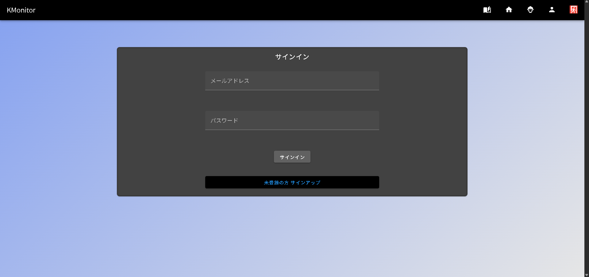
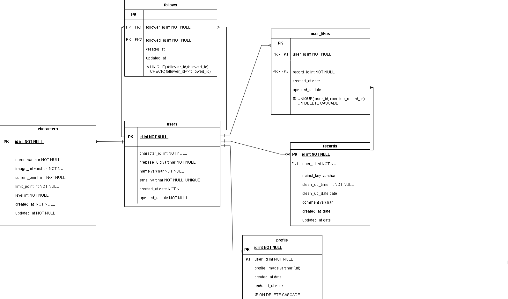

#　KMonitor

## はじめに
- 常に汚い自分の部屋とおさらばするために，片付けを習慣化できるアプリを作成しました!

## コンセプト
- 家に人を呼ぶ前は片付けに気合が入るという自身の経験から，部屋を他人に見てもらうための共有アプリを考えました.（他人に部屋を見られるという監視の目によって自身の片付けの意欲を沸かせる）

## 部屋画像共有の課題・方法

部屋の画像を共有するにあたって以下の問題があります
- 散らばった書類など個人情報が映ってしまう
- 下着など見せたくないものが映ってしまう
- ただの部屋画像だと味気がない

これらの問題を解決し，他の人に見せられるようにするために 部屋画像のイラスト化 を導入しました．
これにより，実際の部屋の汚さは伝わりつつも，共有の心理的なハードルを下げ，他人に見せられるような部屋にするために掃除・きれいな状態の維持をさせる狙いがあります. 

## 主な機能
- ユーザー登録・認証
- 片づけた記録（レコード）のアップロード・取得表示
- 自身のレコード一覧表示
- 他ユーザーのレコード表示
- レコード削除機能
- いいね機能
- オリジナルキャラクタ―表示画面

## 実際の画面
#### ログイン画面

#### 自身のレコード表示
https://youtu.be/sJVHaV_ckNI

#### 全員のレコード表示 + キャラクター表示
https://youtu.be/r0IbwRgQ9JU

#### アップロード画面
27秒の Loading... から レコード一覧表示までの間イラスト生成のために 40秒ほど時間がかかっています（現状の課題です）
https://youtu.be/KkyxXLnOX8I

## こだわり
#### 作成のこだわり
- 共有方法にイラスト化を導入した点
- 動くオリジナルキャラクターを作成したこと（熱になりながら作成したので，愛着あるキャラクターです）

#### 技術的なこだわり
- レスポンシブ対応
- いいね機能を自身のアイディアで実装できたこと
- AWS を新たに学習しデプロイまでできたこと
- コードの依存関係を明確にしたこと

#### AI 活用について
基本方針：開発では自身で実装していき，エラーに詰まった際はweb で調べ，それでも解決しない場合は AI を利用．テストコードはAI に生成してもらいそれらを確認し実装．

## 構成
ディレクトリ構成 https://zenn.dev/yuki_tu/articles/f7636df51eef0a を参考に構成しました．

今回は「片付けをユーザーが記録する」 ことが主題なので，
- ユーザー = user
- 片付けの記録 = record 
の2つの単位で構成しました．

**処理構成**
- ユーザーインターフェース（handler）：クライアントとバックエンドのサーバのやり取りを行う場所
- サービスとドメイン（service）：一連の処理（本来ならサービスとドメインは分けなければならないが，今回は小規模なコードであることや自身が完全にサービスとドメインの区分を理解しきれず責務がバラバラになって開発の手が止まりそうな気がしたので，同じ場所にまとめた・今回は依存関係を明確にする構成というだけで学習の収穫として十分だと考えた・ドメインの考え方などは後日補強していきたい）
  - ユーザーの認証やレコードが存在するか，既に記録に対していいね済かどうかなどのアプリのルールを記述していく
- アダプター（adapter）：db・firebase など外部とのやり取りを行う場所

依存関係： handler -> service -> port <- adapter

### ハンドラー
- クライアントから来たデータ自体のバリデーション
- クライアントから来たデータの読み取り

### サービスとドメイン
- アプリのユースケースを記述

### アダプター
- DB へのデータの直接的なやり取りを含め，外部とのやり取りを記述する

### ER 図

### AWS 構成図

### 学び・反省
- コード依存関係を明確にするだけで新機能追加時や変更時何を変えればよいか，どこに書けばよいかが明確になり，開発効率がよくなった
- デプロイ後 AWS の CloudFront で意図しないキャッシュが発生し，バグを引き起こした．この特定に時間を大きく要したので 本番環境と開発環境での違いを実際に感じることができた．もっといろいろな経験をしたいなと感じた
- git のcommit 粒度やメッセージが適当になってしまったので，2,3ファイルに1commit 抑えて，メッセージも一目で何したかわかるようにしたい・PR も同様
